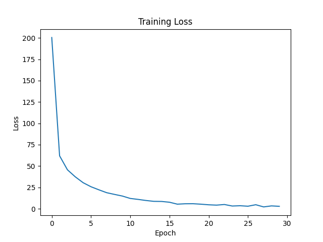
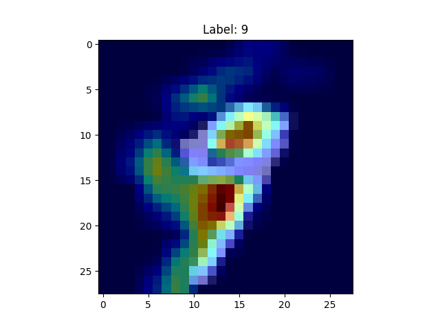

# pytorch-gradcam-mnist

## Overview
This project implements a CNN model for MNIST digit classification using PyTorch and visualizes model decisions using Grad-CAM.
This project focuses on both high accuracy and model interpretability.

## Features
- CNN model (2 convolution layers + fully connected layer)
- MNIST dataset training
- Accuracy evaluation (~99%)
- Grad-CAM visualization

## Tech Stack
- Python
- PyTorch
- torchvision
- matplotlib
- pytorch-grad-cam

## Model Architecture
A simple CNN structure:
Conv2d(1→16) → Conv2d(16→32) → MaxPooling → Linear

## Results
- Accuracy: ~99.7%

## Training Curve


### Grad-CAM Visualization


## Why Grad-CAM?
Grad-CAM helps visualize which parts of the image influence the model's decision, improving transparency and trust in deep learning models.

## How to Run
```bash
pip install -r requirements.txt
python train.py
python gradcam.py
